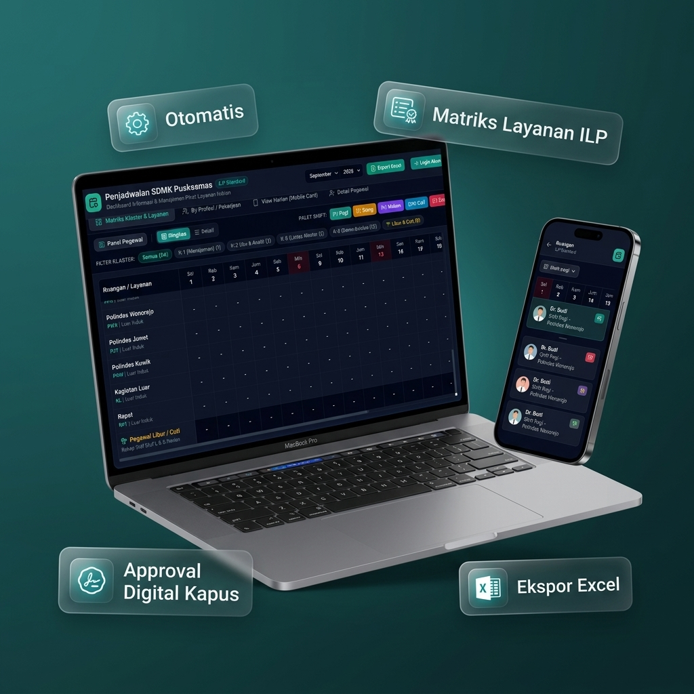
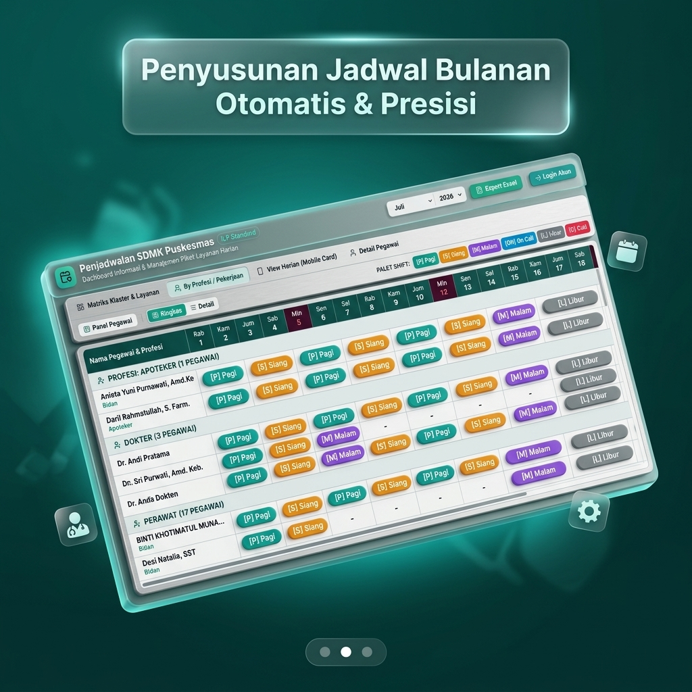

# 📱 Materi Marketing & Posting Instagram - Sistem Penjadwalan SDMK

Dokumen ini berisi panduan materi promosi Instagram, copywriting penjualan, daftar hashtag, serta aset gambar berbasis *screen capture* asli aplikasi **Sistem Penjadwalan SDMK Puskesmas & Klinik**.

---

## 🖼️ Aset Gambar Postingan (Di Folder `docs/images/`)

### Slide 1: Main Banner Showcase (Mockup Laptop & Smartphone Asli Aplikasi)

*File: [`docs/images/ig_post_slide1_showcase.jpg`](file:///d:/penjadwalan-SDMK/docs/images/ig_post_slide1_showcase.jpg)*

### Slide 2: Showcase Matriks Shift per Profesi (Tampilan Real App)

*File: [`docs/images/ig_post_slide2_matriks.jpg`](file:///d:/penjadwalan-SDMK/docs/images/ig_post_slide2_matriks.jpg)*

---

## 📸 Konsep Visual Carousel (5 Slide)

1. **Slide 1 (Cover Hook):** Mockup Laptop & Smartphone Tampilan Aplikasi Penjadwalan SDMK.
   * *Headline:* "Masih Susun Jadwal Shift Nakes Pakai Excel Manual? Waktunya Switch ke Sistem Otomatis!"
2. **Slide 2 (Pain Points):** Problem utama penyusunan jadwal manual di Puskesmas.
   * *Poin:* Bentrok shift, revisi berulang kali, proses ACC Kapus yang lambat.
3. **Slide 3 (Fitur Unggulan 1):** Tampilan Matriks Klaster & Layanan ILP.
   * *Poin:* Pemetaan otomatis per ruangan klinik & klaster layanan primer (ILP).
4. **Slide 4 (Fitur Unggulan 2):** Matriks Shift per Profesi & Export Excel.
   * *Poin:* Pengelompokan Dokter, Perawat, Bidan, Apoteker + Ekspor ke format Excel siap cetak.
5. **Slide 5 (Call To Action / CTA):** Kontak Sales & Penawaran Demo Sistem.
   * *Poin:* "Coba Demo Gratis Sekarang! Hubungi WhatsApp / DM kami."

---

## 📝 Text Copywriting Caption (Tinggal Copas)

```text
Bikin Jadwal Shift Nakes Memang Bikin Pusing... Kalau Masih Pakai Cara Manual! 🤯🏥

Pernah mengalami masalah ini di Puskesmas / Klinik Anda?
❌ Nakes protes karena shift bentrok atau jadwal kurang adil
❌ Butuh berjam-jam (bahkan berhari-hari) buat atur jadwal bulanan
❌ Bolak-balik revisi Excel sebelum di-ACC Kepala Puskesmas
❌ Rekapitulasi absensi & laporan bulanan yang menyita waktu

Saatnya beralih ke cara modern dengan ⚡ SISTEM PENJADWALAN SDMK ⚡
Aplikasi Penjadwalan Kerja Nakes Berbasis Web yang Khusus Dirancang untuk Puskesmas, Klinik, & Faskes!

Fitur Unggulan Yang Bikin Kerja Admin & Kasubag TU Jadi Simpel:
✅ Pemetaan Ruangan & Klaster (Support Konsep ILP / Integrasi Layanan Primer)
✅ Tampilan Matriks Per Profesi (Dokter, Perawat, Bidan, Apoteker)
✅ Manajemen Shift & Piket Fleksibel (Pagi, Siang, Malam, Off, Libur)
✅ Multi-Role Access (Admin SDMK, Kepala Puskesmas, & Pegawai/Nakes)
✅ Workflow Approval Digital (Draft ➔ Pengajuan ➔ ACC Kapus)
✅ Auto-Generate & Export Excel Standar Laporan Lintas Sektor
✅ Akses Real-time dari HP & Laptop – Nakes bisa cek jadwal kapan saja!

🔥 Hemat Hingga 80% Waktu Penyusunan Jadwal & Hilangkan Risiko Human Error!

🎁 PENAWARAN SPESIAL MINGGU INI!
Dapatkan GRATIS DEMO SISTEM & Sesi Konsultasi Penyesuaian Format Template Faskes Anda!

Hubungi kami sekarang untuk akses Demo / Info Lisensi:
📩 DM Instagram: @nama_akun_anda
📱 WhatsApp Sales: 08xx-xxxx-xxxx
🌐 Website: www.namadomainanda.com

#PuskesmasIndonesia #SDMK #FaskesDigital #ManajemenPuskesmas #AplikasiPuskesmas #KepalaPuskesmas #KasubagTU #DinasKesehatan #SoftwareKesehatan #PuskesmasILP #PenjadwalanShift #NakesIndonesia
```

---

## 🏷️ Daftar Hashtag Tersegmentasi

```text
#PuskesmasIndonesia #SDMK #SDMKes #FaskesDigital #ManajemenPuskesmas #AplikasiPuskesmas #KepalaPuskesmas #KasubagTU #DinasKesehatan #Dinkes #SoftwareKesehatan #PuskesmasILP #PenjadwalanShift #NakesIndonesia #SIMRS #Simpus #DokterIndonesia #PerawatIndonesia #BidanIndonesia #DigitalisasiFaskes #AplikasiKesehatan
```
